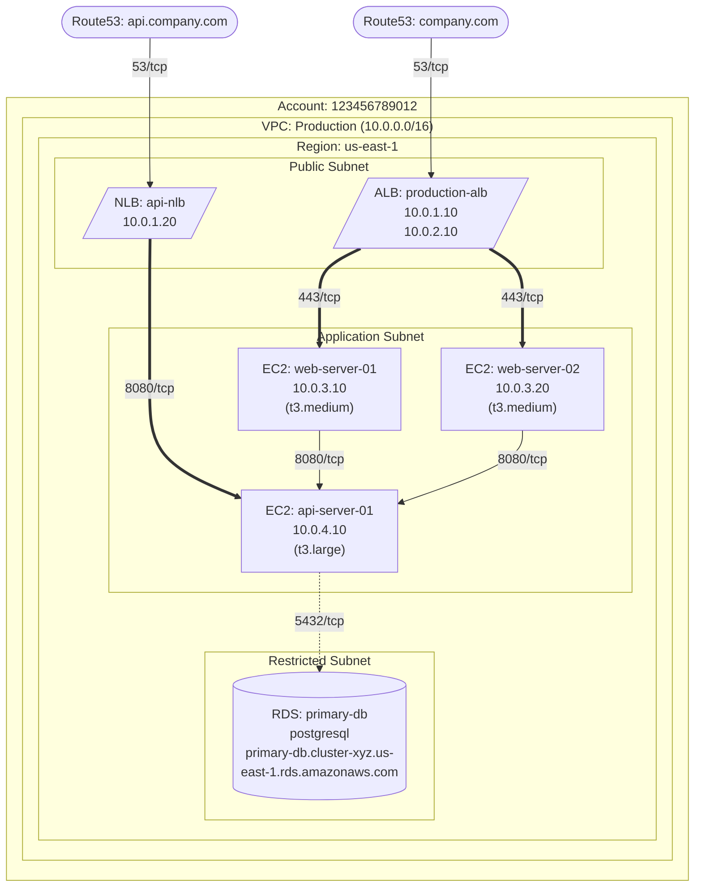

# Usage Examples

This document provides comprehensive examples of using the AWS Infrastructure Diagram MCP Server.

## Table of Contents

- [Basic Examples](#basic-examples)
- [Advanced Usage](#advanced-usage)
- [Real-World Scenarios](#real-world-scenarios)
- [Output Examples](#output-examples)
- [Integration Examples](#integration-examples)

## Basic Examples

### 1. Generate Simple Mermaid Diagram

```python
# Generate a basic Mermaid diagram for your default AWS account
result = generate_aws_diagram({
    "aws_account": "my-company"
})

print(f"Diagram saved to: {result['output_path']}")
print(f"Found {result['statistics']['instances']} EC2 instances")
```

**Output:**
```json
{
  "success": true,
  "output_path": "docs/as-built/my-company/my-company_mermaid.md",
  "statistics": {
    "vpcs": 2,
    "subnets": 6,
    "instances": 8,
    "load_balancers": 2,
    "rds_instances": 1,
    "security_groups": 12,
    "route53_zones": 3,
    "acm_certificates": 2
  },
  "diagram": "graph TD\n    subgraph Account[\"Account: 123456789012\"]..."
}
```

### 2. Generate DOT Diagram with PNG Output

```python
# Generate a professional DOT diagram with AWS icons
result = generate_aws_diagram_dot({
    "aws_account": "production-env",
    "region": "us-west-2",
    "output_format": "png"
})

print(f"PNG diagram: {result['output_files']['png_file']}")
print(f"DOT source: {result['output_files']['dot_file']}")
```

**Output:**
```json
{
  "success": true,
  "output_files": {
    "dot_file": "docs/as-built/production-env/production-env_diagram.dot",
    "png_file": "docs/as-built/production-env/production-env_diagram.png",
    "svg_file": "docs/as-built/production-env/production-env_diagram.svg"
  },
  "statistics": {
    "vpcs": 1,
    "instances": 12,
    "load_balancers": 3
  }
}
```

### 3. Discover Resources Only

```python
# Explore what resources exist before generating diagrams
result = discover_aws_resources({
    "region": "us-east-1",
    "resource_types": ["vpcs", "instances", "load_balancers"]
})

for vpc in result['resources']['vpcs']:
    print(f"VPC: {vpc['vpc_id']} - {vpc['tags'].get('Name', 'Unnamed')}")
```

## Advanced Usage

### 4. Specific VPC with Custom Output Path

```python
# Generate diagram for a specific VPC with custom output location
result = generate_aws_diagram({
    "aws_account": "microservices-prod",
    "vpc_id": "vpc-0123456789abcdef0",
    "region": "eu-west-1",
    "output_path": "/tmp/diagrams/prod-vpc-diagram.md",
    "include_route53": False  # Skip Route53 for simpler diagram
})
```

### 5. Multi-Format Generation

```python
# Generate both Mermaid and DOT formats for the same infrastructure
account = "web-app-staging"
region = "us-west-1"

# Mermaid for documentation
mermaid_result = generate_aws_diagram({
    "aws_account": account,
    "region": region,
    "output_path": f"docs/{account}-mermaid.md"
})

# DOT for presentations
dot_result = generate_aws_diagram_dot({
    "aws_account": account,
    "region": region,
    "output_path": f"diagrams/{account}-presentation",
    "output_format": "svg"
})

print(f"Documentation: {mermaid_result['output_path']}")
print(f"Presentation: {dot_result['output_files']['svg_file']}")
```

### 6. Using Different AWS Profiles

```python
# Generate diagrams for multiple environments
environments = [
    {"profile": "development", "account": "dev-env", "region": "us-east-1"},
    {"profile": "staging", "account": "staging-env", "region": "us-east-1"}, 
    {"profile": "production", "account": "prod-env", "region": "us-west-2"}
]

for env in environments:
    result = generate_aws_diagram({
        "aws_account": env["account"],
        "region": env["region"],
        "profile": env["profile"],
        "output_path": f"docs/environments/{env['account']}-infrastructure.md"
    })
    print(f"{env['account']}: {result['statistics']['instances']} instances")
```

## Real-World Scenarios

### 7. DevOps Documentation Pipeline

```python
# Automated infrastructure documentation for CI/CD
import datetime

def generate_infrastructure_docs():
    environments = ["dev", "staging", "prod"]
    timestamp = datetime.datetime.now().strftime("%Y-%m-%d")
    
    for env in environments:
        # Generate Mermaid for GitLab/GitHub documentation
        mermaid_result = generate_aws_diagram({
            "aws_account": f"{env}-environment",
            "profile": env,
            "output_path": f"docs/infrastructure/{env}-{timestamp}.md"
        })
        
        # Generate PNG for Confluence/presentations
        png_result = generate_aws_diagram_dot({
            "aws_account": f"{env}-environment", 
            "profile": env,
            "output_path": f"diagrams/{env}-{timestamp}",
            "output_format": "png"
        })
        
        print(f"Generated {env} documentation:")
        print(f"  - Mermaid: {mermaid_result['output_path']}")
        print(f"  - PNG: {png_result['output_files']['png_file']}")
        print(f"  - Resources: {mermaid_result['statistics']}")
```

### 8. Security Audit Visualization

```python
# Generate diagrams focusing on security group analysis
def security_audit_diagrams():
    # First discover all resources
    resources = discover_aws_resources({
        "region": "us-east-1",
        "resource_types": ["instances", "rds", "security_groups"]
    })
    
    print("Security Group Analysis:")
    for sg_id, sg_info in resources['resources']['security_groups'].items():
        print(f"\nSecurity Group: {sg_info['name']}")
        for rule in sg_info['rules']['ingress']:
            for source in rule['sources']:
                if source['type'] == 'cidr' and source['value'] == '0.0.0.0/0':
                    print(f"  WARNING: Open to internet on {rule['protocol']}")
    
    # Generate diagram with security focus
    result = generate_aws_diagram_dot({
        "aws_account": "security-audit",
        "include_route53": False,
        "include_acm": False,
        "output_format": "svg"
    })
    
    return result
```

### 9. Disaster Recovery Planning

```python
# Generate diagrams for DR planning across regions
def disaster_recovery_diagrams():
    primary_region = "us-east-1"
    dr_region = "us-west-2"
    
    # Primary region infrastructure
    primary_result = generate_aws_diagram_dot({
        "aws_account": "primary-region",
        "region": primary_region,
        "output_path": "dr-plans/primary-infrastructure",
        "output_format": "pdf"
    })
    
    # DR region infrastructure
    dr_result = generate_aws_diagram_dot({
        "aws_account": "dr-region", 
        "region": dr_region,
        "output_path": "dr-plans/dr-infrastructure",
        "output_format": "pdf"
    })
    
    return {
        "primary": primary_result,
        "dr": dr_result,
        "comparison": {
            "primary_instances": primary_result['statistics']['instances'],
            "dr_instances": dr_result['statistics']['instances'],
            "coverage_ratio": dr_result['statistics']['instances'] / primary_result['statistics']['instances']
        }
    }
```

### 10. Cost Optimization Analysis

```python
# Identify unused resources for cost optimization
def cost_optimization_analysis():
    # Discover all resources
    all_resources = discover_aws_resources({
        "resource_types": ["instances", "load_balancers", "rds"]
    })
    
    # Analyze utilization
    unused_resources = {
        "stopped_instances": [],
        "idle_load_balancers": [],
        "unused_rds": []
    }
    
    # Check for stopped instances
    for instance in all_resources['resources']['instances']:
        if instance['state'] != 'running':
            unused_resources['stopped_instances'].append(instance)
    
    # Generate diagram highlighting optimization opportunities
    result = generate_aws_diagram({
        "aws_account": "cost-optimization",
        "output_path": "cost-analysis/current-infrastructure.md"
    })
    
    return {
        "diagram": result,
        "optimization_opportunities": unused_resources
    }
```

## Output Examples

### Mermaid Diagram Output

```markdown
# AWS Infrastructure Diagram


```

### DOT Diagram Metadata

```json
{
  "generator": "python-diagrams",
  "format": "dot/graphviz",
  "files": {
    "dot_file": "/path/to/aws_infrastructure.dot",
    "png_file": "/path/to/aws_infrastructure.png",
    "svg_file": "/path/to/aws_infrastructure.svg"
  },
  "description": "AWS Infrastructure Diagram generated using Python Diagrams library"
}
```

## Integration Examples

### 11. GitLab CI/CD Integration

**.gitlab-ci.yml:**
```yaml
stages:
  - document-infrastructure

document-aws:
  stage: document-infrastructure
  image: python:3.11
  before_script:
    - pip install uv
    - uv sync
  script:
    - uv run python -c "
        from aws_diagram_mcp.server import generate_aws_diagram;
        result = generate_aws_diagram({
            'aws_account': 'production',
            'region': 'us-west-2',
            'profile': 'ci-readonly',
            'output_path': 'docs/infrastructure.md'
        });
        print(f'Generated diagram: {result[\"output_path\"]}')
      "
  artifacts:
    paths:
      - docs/infrastructure.md
    expire_in: 30 days
  only:
    - main
```

### 12. GitHub Actions Integration

**.github/workflows/document-infrastructure.yml:**
```yaml
name: Document Infrastructure

on:
  schedule:
    - cron: '0 6 * * 1'  # Weekly on Monday
  workflow_dispatch:

jobs:
  generate-diagrams:
    runs-on: ubuntu-latest
    
    steps:
    - uses: actions/checkout@v4
    
    - name: Install Graphviz
      run: sudo apt-get install -y graphviz
    
    - name: Setup Python
      uses: actions/setup-python@v4
      with:
        python-version: '3.11'
    
    - name: Install uv
      run: pip install uv
    
    - name: Install dependencies
      run: uv sync
    
    - name: Generate Mermaid diagrams
      env:
        AWS_ACCESS_KEY_ID: ${{ secrets.AWS_ACCESS_KEY_ID }}
        AWS_SECRET_ACCESS_KEY: ${{ secrets.AWS_SECRET_ACCESS_KEY }}
      run: |
        uv run python -c "
        from aws_diagram_mcp.server import generate_aws_diagram
        result = generate_aws_diagram({
            'aws_account': 'production',
            'output_path': 'docs/production-infrastructure.md'
        })
        print('Generated:', result['output_path'])
        "
    
    - name: Generate DOT diagrams  
      env:
        AWS_ACCESS_KEY_ID: ${{ secrets.AWS_ACCESS_KEY_ID }}
        AWS_SECRET_ACCESS_KEY: ${{ secrets.AWS_SECRET_ACCESS_KEY }}
      run: |
        uv run python -c "
        from aws_diagram_mcp.server import generate_aws_diagram_dot
        result = generate_aws_diagram_dot({
            'aws_account': 'production',
            'output_path': 'diagrams/production',
            'output_format': 'png'
        })
        print('Generated:', result['output_files'])
        "
    
    - name: Commit diagrams
      run: |
        git config --local user.email "action@github.com"
        git config --local user.name "GitHub Action"
        git add docs/ diagrams/
        git diff --staged --quiet || git commit -m "Update infrastructure diagrams"
        git push
```

### 13. Terraform Integration

**main.tf:**
```hcl
# Generate diagrams after Terraform apply
resource "null_resource" "generate_diagrams" {
  depends_on = [
    aws_instance.web_servers,
    aws_lb.application_load_balancer,
    aws_db_instance.database
  ]
  
  provisioner "local-exec" {
    command = <<-EOT
      uv run python -c "
      from aws_diagram_mcp.server import generate_aws_diagram, generate_aws_diagram_dot
      
      # Generate both formats
      mermaid_result = generate_aws_diagram({
          'aws_account': '${var.environment}',
          'region': '${var.aws_region}',
          'output_path': 'terraform-docs/${var.environment}-infrastructure.md'
      })
      
      dot_result = generate_aws_diagram_dot({
          'aws_account': '${var.environment}',
          'region': '${var.aws_region}',
          'output_path': 'terraform-docs/${var.environment}-diagram',
          'output_format': 'svg'
      })
      
      print('Generated infrastructure documentation')
      "
    EOT
  }

  triggers = {
    always_run = timestamp()
  }
}
```

### 14. Ansible Integration

**playbook.yml:**
```yaml
---
- name: Generate AWS Infrastructure Diagrams
  hosts: localhost
  gather_facts: false
  
  tasks:
    - name: Install diagram generator
      pip:
        name: 
          - uv
        state: present
    
    - name: Generate Mermaid diagram
      shell: |
        uv run python -c "
        from aws_diagram_mcp.server import generate_aws_diagram
        result = generate_aws_diagram({
            'aws_account': '{{ aws_account_name }}',
            'region': '{{ aws_region }}',
            'profile': '{{ aws_profile }}',
            'output_path': 'inventories/{{ environment }}/infrastructure.md'
        })
        print(result['statistics'])
        "
      register: diagram_result
      
    - name: Show generation results
      debug:
        var: diagram_result.stdout
```

These examples demonstrate the flexibility and power of the AWS Infrastructure Diagram MCP Server across various use cases and integration scenarios.