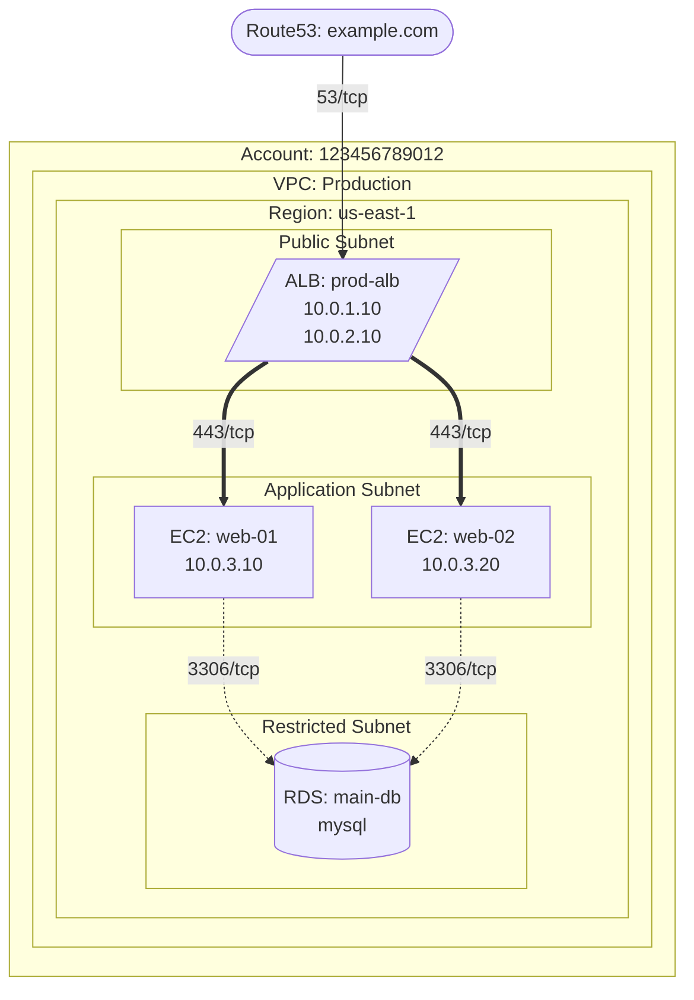

# AWS Infrastructure Diagram MCP Server

An MCP (Model Context Protocol) server that generates comprehensive AWS infrastructure diagrams in both Mermaid and DOT/Graphviz formats. This tool automatically discovers AWS resources and creates hierarchical diagrams showing VPCs, subnets, EC2 instances, load balancers, RDS instances, and their security group connections.

## Features

- **Comprehensive Resource Discovery**: Automatically discovers VPCs, subnets, EC2 instances, load balancers, RDS instances, security groups, Route53 zones, and ACM certificates
- **Hierarchical Organization**: Organizes resources by Account > VPC > Region > Subnet tiers
- **Security Group Analysis**: Maps actual connections between resources based on security group rules
- **Load Balancer Mapping**: Shows real target group connections, not assumptions
- **Dual Output Formats**: 
  - **Mermaid**: Text-based diagrams for documentation and web display
  - **DOT/Graphviz**: Professional diagrams with AWS icons (PNG, SVG, PDF output)
- **Flexible Configuration**: Supports AWS profiles, regions, and selective resource discovery

## Installation

### Using uv (Recommended)

```bash
# Clone or create the project
cd aws-diagram-mcp

# Install dependencies
uv sync

# Install in development mode
uv pip install -e .
```

### Using pip

```bash
# Install dependencies
pip install -r requirements.txt

# Install in development mode
pip install -e .
```

### System Requirements

For DOT/Graphviz diagram generation, you'll need Graphviz installed on your system:

**macOS:**
```bash
brew install graphviz
```

**Ubuntu/Debian:**
```bash
sudo apt-get install graphviz
```

**Windows:**
Download from https://graphviz.org/download/ or use Chocolatey:
```bash
choco install graphviz
```

## Quick Start

### 1. Configure AWS Credentials

Choose one method:

**Option A: AWS CLI (Recommended)**
```bash
aws configure --profile myprofile
```

**Option B: Environment Variables**
```bash
export AWS_ACCESS_KEY_ID=your_access_key
export AWS_SECRET_ACCESS_KEY=your_secret_key
export AWS_DEFAULT_REGION=us-east-1
```

### 2. Configure MCP Client

Add to your Claude Desktop configuration (`~/Library/Application Support/Claude/claude_desktop_config.json`):

```json
{
  "mcpServers": {
    "aws-diagram": {
      "command": "uv",
      "args": ["run", "python", "-m", "aws_diagram_mcp"],
      "cwd": "/absolute/path/to/aws-diagram-mcp",
      "env": {
        "AWS_PROFILE": "your-profile",
        "AWS_DEFAULT_REGION": "us-east-1"
      }
    }
  }
}
```

### 3. Test the Setup

```bash
# Test AWS access
aws sts get-caller-identity --profile your-profile

# Test server startup
cd /path/to/aws-diagram-mcp
uv run python -m aws_diagram_mcp
```

## Configuration

For detailed configuration instructions, see:
- **[CONFIGURATION.md](CONFIGURATION.md)** - Complete setup guide
- **[USAGE.md](USAGE.md)** - Usage examples and workflows  
- **[TROUBLESHOOTING.md](TROUBLESHOOTING.md)** - Common issues and solutions

## Usage

### Generate Mermaid Diagram

```python
# Generate Mermaid diagram for entire AWS account
result = generate_aws_diagram({
    "aws_account": "my-prod-account",
    "region": "us-east-1",
    "profile": "production"
})
```

### Generate DOT/Graphviz Diagram

```python
# Generate professional DOT diagram with AWS icons
result = generate_aws_diagram_dot({
    "aws_account": "my-prod-account",
    "region": "us-east-1",
    "profile": "production",
    "output_format": "png"  # png, svg, pdf, or dot
})
```

### Generate Diagram for Specific VPC

```python
# Generate diagram for specific VPC only (works with both formats)
result = generate_aws_diagram({
    "aws_account": "my-account", 
    "vpc_id": "vpc-12345678",
    "region": "us-west-2"
})
```

### Discover Resources Only

```python
# Discover resources without generating diagram
result = discover_aws_resources({
    "region": "us-east-1",
    "resource_types": ["instances", "load_balancers", "rds"]
})
```

### Validate Mermaid Syntax

```python
# Validate diagram syntax
result = validate_mermaid_syntax(diagram_string)
```

## Available Tools

### `generate_aws_diagram`

Generates a comprehensive AWS infrastructure diagram in Mermaid format.

**Parameters:**
- `aws_account` (str): AWS account ID or alias for the diagram
- `region` (str, default="us-east-1"): AWS region to scan
- `profile` (str, optional): AWS CLI profile to use
- `output_path` (str, optional): Path to save the markdown file
- `vpc_id` (str, optional): Specific VPC ID to diagram
- `include_route53` (bool, default=True): Include Route53 zones
- `include_acm` (bool, default=True): Include ACM certificates

**Returns:**
- `success` (bool): Whether the operation succeeded
- `output_path` (str): Path where diagram was saved
- `statistics` (dict): Count of discovered resources
- `diagram` (str): The generated Mermaid diagram

### `generate_aws_diagram_dot`

Generates a comprehensive AWS infrastructure diagram in DOT/Graphviz format with AWS icons.

**Parameters:**
- `aws_account` (str): AWS account ID or alias for the diagram
- `region` (str, default="us-east-1"): AWS region to scan
- `profile` (str, optional): AWS CLI profile to use
- `output_path` (str, optional): Path to save diagram files (without extension)
- `vpc_id` (str, optional): Specific VPC ID to diagram
- `include_route53` (bool, default=True): Include Route53 zones
- `include_acm` (bool, default=True): Include ACM certificates
- `output_format` (str, default="png"): Output format (png, svg, pdf, dot)

**Returns:**
- `success` (bool): Whether the operation succeeded
- `output_files` (dict): Paths to generated files (DOT, PNG, SVG)
- `statistics` (dict): Count of discovered resources

### `discover_aws_resources`

Discovers AWS resources without generating a diagram.

**Parameters:**
- `region` (str, default="us-east-1"): AWS region to scan
- `profile` (str, optional): AWS CLI profile to use
- `resource_types` (list): Types to discover (or ["all"])

**Returns:**
- `success` (bool): Whether the operation succeeded
- `resources` (dict): Discovered resources by type

### `validate_mermaid_syntax`

Validates Mermaid diagram syntax.

**Parameters:**
- `diagram` (str): Mermaid diagram string to validate

**Returns:**
- `valid` (bool): Whether syntax is valid
- `error` (str, optional): Error message if invalid

## Diagram Structure

### Hierarchical Organization

The generated diagrams follow this structure:

```
Account
├── VPC
    ├── Region
        ├── Presentation Subnet (Public)
        │   ├── Application Load Balancers
        │   └── Network Load Balancers
        ├── Application Subnet (Private)
        │   ├── EC2 Instances
        │   └── Auto Scaling Groups
        └── Restricted Subnet (Database)
            └── RDS Instances
```

### Visual Elements

- **Route53**: Stadium shape `([Route53])`
- **Load Balancers**: Trapezoid `/[ALB]\`
- **EC2 Instances**: Rectangle `[EC2]`
- **RDS Instances**: Cylinder `[(RDS)]`

### Connection Types

- **Route53 → Load Balancers**: `-->`  (53/tcp)
- **Load Balancers → EC2**: `==>` (443/tcp, 80/tcp)
- **EC2 → RDS**: `-.->` (3306/tcp, 5432/tcp)
- **EC2 → EC2**: `-->` (22/tcp, custom ports)

## Example Output

### Mermaid Format



### DOT/Graphviz Format

The DOT format generates professional diagrams with:
- **AWS Service Icons**: Authentic AWS icons for EC2, RDS, ALB, Route53
- **Hierarchical Clustering**: VPC, Region, and Subnet groupings with colored backgrounds
- **Styled Connections**: Different arrow styles and colors for different connection types
- **Multiple Output Formats**: PNG, SVG, PDF, and raw DOT files
- **High Resolution**: Vector graphics suitable for documentation and presentations

Example output files:
- `aws_infrastructure.dot` - DOT source file
- `aws_infrastructure.png` - High-resolution PNG image
- `aws_infrastructure.svg` - Scalable vector graphic
- `aws_infrastructure_metadata.json` - Generation metadata

## Security Considerations

- **Read-Only Access**: The server only requires read permissions
- **No Resource Modification**: No AWS resources are created or modified
- **Credential Security**: Uses standard AWS credential handling
- **Local Processing**: All diagram generation happens locally

### Required AWS Permissions

```json
{
    "Version": "2012-10-17",
    "Statement": [
        {
            "Effect": "Allow",
            "Action": [
                "ec2:Describe*",
                "elasticloadbalancing:Describe*",
                "rds:Describe*",
                "route53:List*",
                "route53:Get*",
                "acm:List*",
                "acm:Describe*",
                "sts:GetCallerIdentity"
            ],
            "Resource": "*"
        }
    ]
}
```

## Development

### Running Tests

```bash
uv run pytest
```

### Linting and Formatting

```bash
uv run ruff check .
uv run black .
```

### Running the Server Directly

```bash
# Run as module
uv run python -m aws_diagram_mcp

# Or run the server function
uv run python -c "from aws_diagram_mcp import serve; serve()"
```

## Troubleshooting

### Common Issues

1. **AWS Credentials Not Found**
   ```
   Error: Unable to locate credentials
   ```
   Solution: Configure AWS credentials using `aws configure` or environment variables

2. **No Resources Found**
   ```
   Error: No VPCs found
   ```
   Solution: Check the region and ensure resources exist in the specified region

3. **Permission Denied**
   ```
   Error: User is not authorized to perform: ec2:DescribeInstances
   ```
   Solution: Ensure your AWS credentials have the required read permissions

4. **Mermaid Syntax Errors**
   ```
   Error: Unclosed subgraph
   ```
   Solution: Use the `validate_mermaid_syntax` tool to check for syntax issues

5. **Graphviz Not Found**
   ```
   Error: dot not found in path
   ```
   Solution: Install Graphviz system package (see Installation section)

### Debug Mode

Set `LOG_LEVEL=DEBUG` in your environment to enable verbose logging:

```bash
export LOG_LEVEL=DEBUG
uv run python -m aws_diagram_mcp
```

## Contributing

1. Fork the repository
2. Create a feature branch
3. Make your changes
4. Add tests for new functionality
5. Run tests and linting
6. Submit a pull request

## License

This project is licensed under the MIT License - see the LICENSE file for details.

## Documentation

📚 **Comprehensive Guides:**
- **[CONFIGURATION.md](CONFIGURATION.md)** - Detailed setup and configuration
- **[USAGE.md](USAGE.md)** - Usage examples and best practices
- **[EXAMPLES.md](EXAMPLES.md)** - Real-world scenarios and integrations
- **[TROUBLESHOOTING.md](TROUBLESHOOTING.md)** - Common issues and solutions
- **[CHANGELOG.md](CHANGELOG.md)** - Version history and updates

## Support

For issues and questions:

1. **Check Documentation**: Review the guides above for detailed help
2. **Troubleshooting**: See [TROUBLESHOOTING.md](TROUBLESHOOTING.md) for common issues
3. **Examples**: Check [EXAMPLES.md](EXAMPLES.md) for usage patterns
4. **GitHub Issues**: Search existing issues or create a new one with detailed information

## Roadmap

- [x] Support for DOT/Graphviz output with AWS icons
- [x] Professional diagram formatting with proper clustering
- [ ] Support for additional AWS services (Lambda, API Gateway, CloudFront)
- [ ] Interactive diagram filtering and customization
- [ ] Export to other diagram formats (draw.io, PlantUML)
- [ ] Cost analysis integration
- [ ] Multi-region diagram generation
- [ ] Real-time diagram updates
- [ ] Custom styling and themes for both Mermaid and DOT outputs